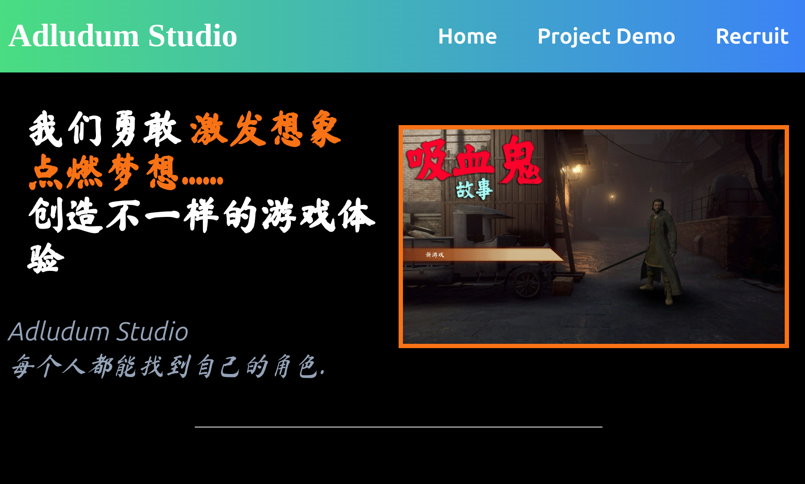

<!-- PROJECT LOGO -->
<br />
<div align="center">
  <a href="https://github.com/othneildrew/Best-README-Template">
    
  </a>

  <h3 align="center">Website Template</h3>

  <p align="center">
    A static website demo 
    <br />
    <br />
    <a href="https://adludumstudios.com/">View Demo</a>
  </p>
</div>


<!-- ABOUT THE PROJECT -->
## About The Project

### That's a screenshot of website.
<!--  -->


### A good tutorial for Tailwindcss study.


### Built With Tailwindcss


<!-- GETTING STARTED -->
## Getting Started

This is an example of how you may give instructions on setting up your project locally.
To get a local copy up and running follow these simple example steps.

### Installation

This is an example of how to list things you need to use the software and how to install them.
* npm
  ```sh
  npm install
  npm run tailwind
  ```
* use 'live server' (a plugin for vscode ) to start 'index.html' file.


<!-- LICENSE -->
## License

Distributed under the MIT License. 


